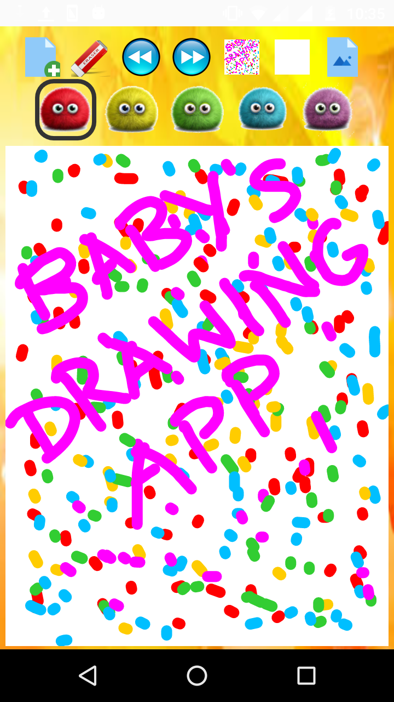
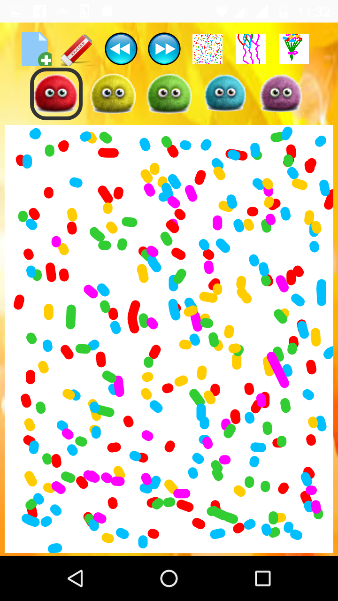
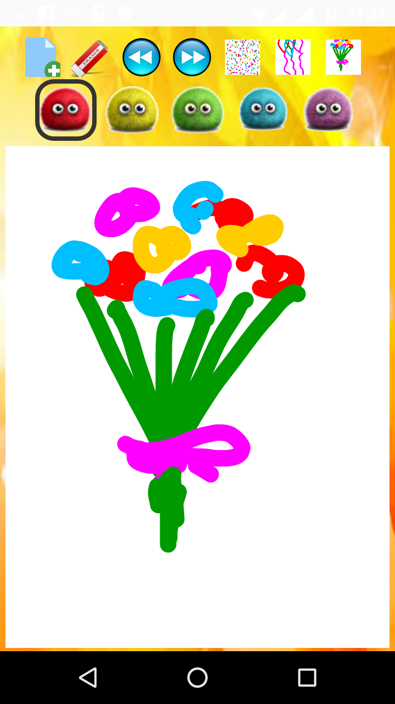
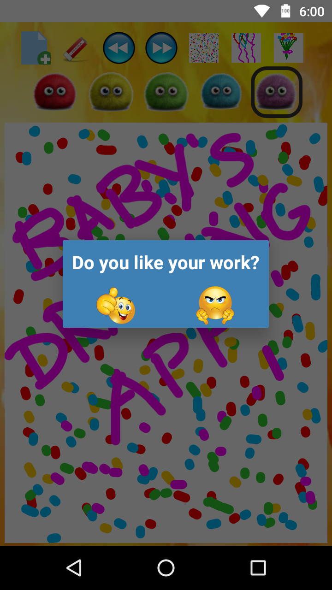
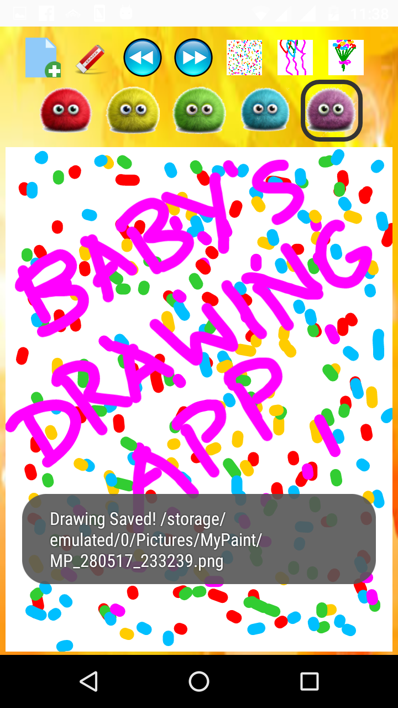

# Baby-Drawing-App
Baby's Drawing App is a simple drawing app. Two year old and older children can use it to scribble and draw. Voice prompts and cool music have been used to make the app interactive. This app has been developed by Rishabh Singh, Ravi Kumar, Ravi Prakash, Robin Ratan, Savita Yadav and Pinaki Chakraborty.

&nbsp;
&nbsp;
&nbsp;
&nbsp;
&nbsp;